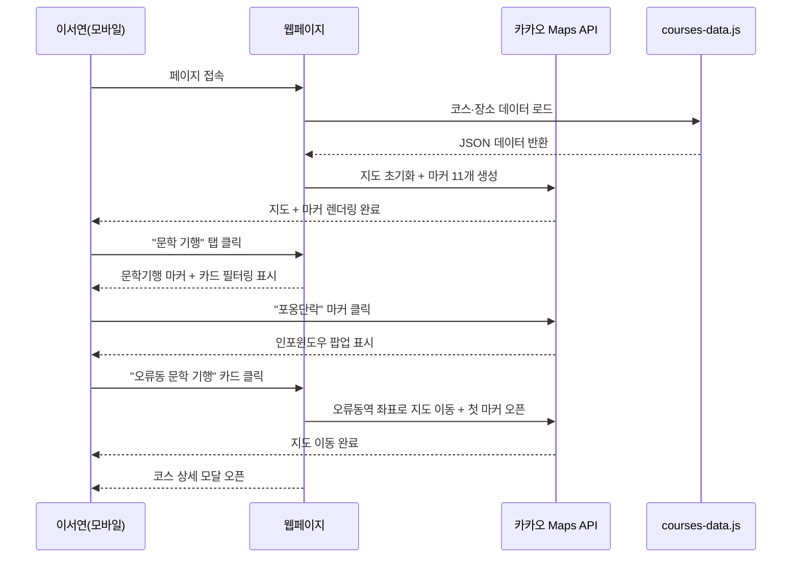
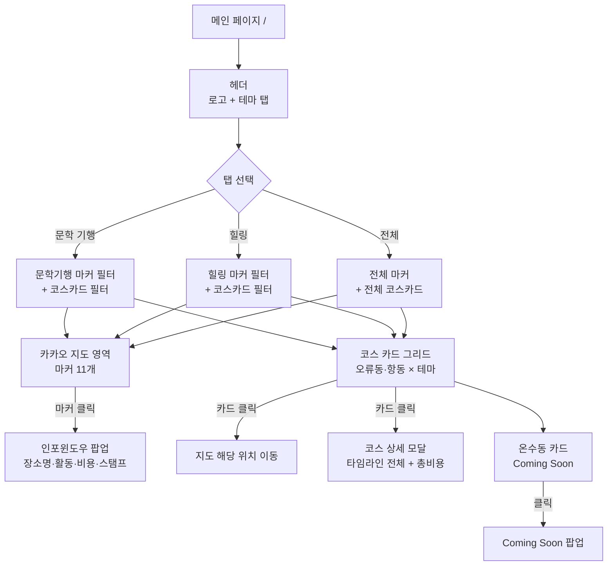
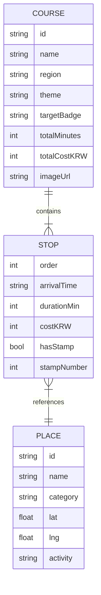
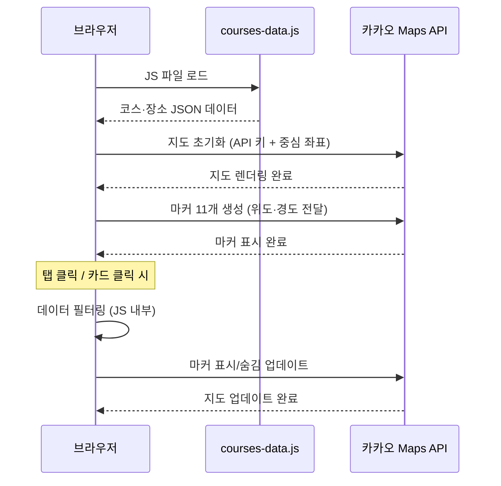

# 구로 여행코스 PRD

> 작성일: 2026-06-02 · 버전: v1.0 · 작성자: 김효진
> 다음 단계: FRD (`prd-구로여행코스-20260602-handoff.md` 참조)

---

## 1. 한 문단 요약

구로구 오류동·항동에 독립서점 4곳, 오류버들시장, 푸른수목원, 천왕산 책쉼터가 흩어져 있지만 연결 동선이 없어 방문객이 지역 상권에 머물지 못하고 이탈한다는 문제에서 출발했다. 이 서비스는 인터랙티브 지도 위에 11개 장소를 핀으로 표시하고, 핀을 클릭하면 장소 정보·예상 비용·스탬프 여부가 팝업으로 뜨는 구로구 여행 큐레이션 웹페이지다. 주요 타깃은 인스타·블로그로 독립서점 콘텐츠를 즐기는 2030 여성 1~2인이며, 교육 과정 포트폴리오로 제작한다.

1인 개발자가 2일 안에 서버 없이 정적 HTML+JavaScript+Tailwind CSS와 Kakao Maps API만으로 구현한다. 온수동 코스는 데이터 미확보로 v1에서 "Coming Soon" 처리하고 오류동·항동 코스 4개를 우선 완성한다. 주요 리스크는 Kakao API 키 보안과 11개 장소 좌표 수급이며, 두 항목 모두 개발 착수 전 해결 가능한 수준이다.

---

## 2. 왜 만드는가

### 2.1 현재 어떻게 일하고 있나

지금 이서연(27세, 핵심 페르소나)이 "구로구 독립서점 코스"를 알아볼 때 걸리는 시간은 30분 이상이다. 네이버 블로그에서 서점 위치를 하나씩 검색하고, 카카오맵에서 각 장소를 개별로 찾아 핀을 꽂고, 이동 경로가 합리적인지 직접 계산한다. 오류버들시장과 항동 수목원이 같은 날 묶을 수 있는 거리인지조차 지도를 보며 손으로 확인해야 한다.

### 2.2 무엇이 답답한가

블로그 후기는 장소 단위로 흩어져 있고 최신 정보인지 알 수 없다. 구로구청 홈페이지는 정보가 있지만 지도 연동이 없고 동선 안내가 없다. 동네서점 지도 앱은 서점 위치만 보여줄 뿐 코스로 연결해주지 않는다. 결국 각 도구의 정보를 직접 조합하는 수고는 온전히 방문객의 몫이다.

### 2.3 우리가 어떻게 바꾸는가

이 페이지에 접속하면 오류동역에서 천왕산 책쉼터까지의 동선이 지도 위에 이미 그려져 있다. 핀을 클릭하면 "10:40 도착 | 큐레이션 독립출판물 탐방 | 예상 비용 10,000원 | 스탬프 ①" 같은 구체적인 정보가 바로 뜬다. 탭에서 "문학 기행" 또는 "힐링"을 선택하면 지도와 카드가 동시에 필터링된다. 흩어진 정보를 직접 조합하던 30분이 지도 핀 한 번 클릭으로 대체된다.

---

## 3. 누가 쓰는가

이 서비스를 가장 먼저, 가장 자주 쓸 사람은 이서연이다. 그는 남들이 잘 모르는 감성 장소를 발굴하는 데서 만족을 얻는 타입으로, 유명 관광지보다 동네의 작은 독립서점에 더 끌린다. 예산이 한정된 만큼 가기 전에 예상 비용을 미리 확인하고, 사진이 잘 나올 것 같은 장소인지도 중요한 판단 기준이다.

### 3.1 핵심 페르소나

| 변수 | 값 |
|---|---|
| 이름 | 이서연 |
| 나이·직업 | 27세, 수도권 직장인 |
| 디지털 숙련도 | 중상 — 인스타 릴스·네이버 블로그 일상 사용, 앱 설치 거부감 없음 |
| 주 사용 기기 | 스마트폰 (여행 중 현장 확인), 사전 조사 시 PC |
| 사용 맥락 | 주말 나들이 전날 밤 또는 당일 아침 — "오늘 뭐 하지?"를 해결하려 검색 |
| 핵심 동기 | "남들이 잘 모르는 감성 서점 + 자연 코스를 하루에 묶고 싶다" |
| 좌절 경험 | 블로그·지도·인스타를 각각 열어 직접 동선 조합하다 30분 낭비 |
| 의사결정 기준 | 예상 비용이 합리적인지 + 사진이 잘 나올 것 같은 장소인지 |

### 3.2 보조 페르소나

2030 커플은 데이트 코스로, 4050 문학·자연 선호자는 주말 가족 나들이로 이 서비스를 찾는다. 두 페르소나 모두 이서연과 동일한 탐색 흐름(지도 → 탭 필터 → 카드 클릭)을 사용하므로 별도 화면 분기 없이 타깃 배지로 구분한다.

### 3.3 비대상 사용자

로그인·계정이 필요한 사용자, 구로구 외 지역 여행 정보를 원하는 사용자, 실시간 영업시간이나 예약 기능을 기대하는 사용자는 이 서비스의 대상이 아니다.

---

## 4. 사용자 시나리오

이 서비스가 어떻게 쓰이는지 세 가지 상황으로 보여준다. 첫 번째는 정상 흐름, 두 번째는 네트워크가 느릴 때, 세 번째는 미완성 콘텐츠를 만났을 때다.

### 시나리오 1: Happy Path — 이서연의 주말 나들이 코스 탐색

이서연은 토요일 아침, 스마트폰으로 "구로구 독립서점"을 검색하다 이 페이지를 발견한다. 접속하자마자 지도 위에 초록·노랑·파랑 마커들이 오류동역에서 천왕산까지 이어진 동선으로 표시된다. 그는 상단 탭에서 "문학 기행"을 누른다. 지도 마커 중 문학 기행과 무관한 것들이 사라지고 관련 코스 카드만 아래에 남는다.

그가 초록 마커 "포옹단락"을 누르자 인포윈도우가 열리며 "10:40 도착 | 큐레이션 독립출판물 탐방 | 예상 비용 10,000원 | 스탬프 ①"이 표시된다. 아래 코스 카드 "오류동 문학 기행"을 클릭하면 지도가 오류동역 방향으로 이동하면서 첫 번째 마커를 자동으로 열고, 모달이 열리며 11개 장소의 타임라인 전체와 1인 예상 총비용 55,000원이 표시된다. 이서연은 모달을 스크린샷 찍어 친구에게 보낸다.



### 시나리오 2: 예외 — 지도가 느리게 로딩될 때

LTE 신호가 약한 환경에서 접속하면 카카오 지도 타일(지도를 이루는 이미지 조각들)이 늦게 불러와진다. 이때 지도 영역에는 회색 스켈레톤이 표시되고, 아래 코스 카드 섹션은 지도와 독립적으로 먼저 로드된다. 이서연은 지도가 완성되기 전에도 카드를 보고 어떤 코스인지 파악할 수 있다. 지도 로드가 완료되면 마커가 순차적으로 표시된다.

### 시나리오 3: 온수동 "Coming Soon" 상태

온수동 코스 카드는 흐릿한 회색으로 표시되며 "Coming Soon" 배지가 붙어 있다. 지도 위 온수동 구역 마커도 회색으로 비활성화되어 있다. 클릭하면 "온수동 코스는 곧 업데이트됩니다. 2025년 답사 기준으로 준비 중입니다." 팝업이 뜨고 클릭 시 닫힌다. 이를 통해 미완성 상태임을 명확히 하면서도 서비스 전체가 깨진 것처럼 보이지 않는다.

---

## 5. 무엇을 만드는가

이 챕터에서는 화면 구조, 핵심 기능, 데이터 모델 개요를 본다. 기능 ID 카탈로그(F-001 등)와 데이터 스키마 상세는 핸드오프 파일을 참조한다.

### 5.1 화면 구조

이 서비스는 URL이 하나인 단일 페이지로 구성된다. 로그인·회원가입 페이지가 없고, 별도 상세 페이지 이동도 없다. 모든 인터랙션은 한 화면 안에서 탭 전환·마커 클릭·모달 오픈으로 이루어진다.



### 5.2 핵심 기능

#### 5.2.1 지도 인터랙션

이 서비스의 핵심 차별점은 지도에 있다. 카카오 지도 위에 11개 장소가 세 가지 색 마커로 구분되어 표시된다. 초록은 독립서점, 노랑은 시장·카페, 파랑은 자연·문화 거점이다. 마커를 클릭하면 인포윈도우가 열리며 해당 장소의 코스 순서·활동 내용·예상 비용·스탬프 여부를 한눈에 확인할 수 있다. 코스 카드를 클릭하면 지도가 해당 코스의 첫 번째 마커 위치로 자동 이동하고 줌인되어 지도와 카드 정보가 항상 동기화된다.

#### 5.2.2 코스 탐색

상단 탭에서 테마(전체·문학기행·힐링)를 선택하면 지도 마커와 하단 코스 카드가 동시에 필터링된다. 각 코스 카드에는 코스명·총 소요 시간·1인 예상 비용·타깃 배지(1인·커플·4050)가 표시되어 "이게 나를 위한 코스인가"를 즉시 판단할 수 있다. 카드를 클릭하면 모달이 열리며 11개 장소의 타임라인(방문 시간·활동·체류 시간·예상 비용·스탬프 여부)과 총비용이 표시된다. 모달은 배경 클릭 또는 X 버튼으로 닫힌다.

#### 5.2.3 콘텐츠 표시

모든 코스 카드에는 대표 이미지 1장이 붙는다. 이미지는 답사 당시 촬영본 또는 공개 이미지를 사용한다. 모달 내 타임라인은 텍스트 중심으로 구성하되 간격·색상으로 가독성을 확보한다. 페이지 하단에는 "본 정보는 2025년 5월 27일 답사 기준이며, 방문 전 확인을 권장합니다"라는 안내 문구가 고정된다.

> 정밀한 기능 ID 카탈로그(F-001~F-019)와 각 기능의 Empty·Loading·Error 상태는 핸드오프 파일 §2 참조.

### 5.3 데이터 모델 (개요)

데이터베이스 없이 `courses-data.js` 정적 파일에 두 가지 구조를 담는다. 장소(Place)는 위도·경도 좌표와 카테고리를 가지고, 코스(Course)는 여러 장소를 순서(Stop)로 연결한다. 브라우저가 파일을 읽어 지도 마커와 코스 카드를 동시에 그린다.



> 전체 JavaScript 데이터 구조와 11개 장소 좌표 테이블은 핸드오프 파일 §3 참조.

---

## 6. 어떻게 만드는가

기술 스택과 컴포넌트 구조, 보안 핵심 결정을 다룬다. 상세한 구현 방식은 FRD와 TRD에서 결정한다.

### 6.1 기술 구조 요약

서버가 없는 정적 웹사이트 구조로, HTML+Tailwind CSS+JavaScript 세 파일 유형과 외부 의존성 하나(Kakao Maps API)만으로 동작한다. 모바일 우선 설계를 기본 원칙으로 하여 375px 뷰포트를 기준으로 레이아웃을 설계하고 데스크탑으로 확장한다.

| 영역 | 선택 | 이유 |
|---|---|---|
| 플랫폼 | 정적 HTML + Vanilla JavaScript | 서버 불필요. 2일 내 구현에 최적 |
| 스타일링 | Tailwind CSS CDN (모바일 우선) | `sm:` `md:` 접두사로 반응형 처리 간편 |
| 지도 | Kakao Maps API v3 | 무료·한국어 지원·당일 발급 가능 |
| 데이터 | courses-data.js (정적 JS 파일) | DB 없이 브라우저가 직접 로드 |
| 호스팅 | GitHub Pages 또는 Netlify | 무료·5분 배포 |
| API 키 보안 | Kakao Developers 도메인 제한 설정 | 키 노출되어도 등록 도메인에서만 작동 |

### 6.2 컴포넌트 간 호출 구조

페이지가 열리면 브라우저가 `courses-data.js`를 먼저 로드해 코스·장소 데이터를 메모리에 올린다. 이후 Kakao Maps API에 지도 초기화를 요청하고, 데이터의 위도·경도를 사용해 마커를 생성한다. 사용자가 탭을 선택하거나 카드를 클릭하면 JavaScript가 데이터를 필터링하여 지도 마커 표시 여부와 카드 목록을 동시에 업데이트한다.



### 6.3 보안 핵심

Kakao Maps API 키는 클라이언트 측 JavaScript에 포함되어 소스 보기로 노출된다. 이를 보완하기 위해 Kakao Developers 콘솔에서 허용 도메인(예: `username.github.io`)을 등록해야 한다. 등록된 도메인 외에서 키를 사용하면 API가 응답하지 않는다. 개인 정보를 수집하지 않고 로그인 기능이 없으므로 추가 보안 정책은 불필요하다.

### 6.4 외부 통합

| 서비스 | 용도 | 인증 방식 |
|---|---|---|
| Kakao Maps API v3 | 지도 렌더링·마커·인포윈도우 | JavaScript 앱 키 (CDN 스크립트에 포함) |
| GitHub Pages / Netlify | 정적 파일 호스팅 | 없음 (무료 공개 호스팅) |

---

## 7. 일정·자원·KPI

### 7.1 일정과 자원

| 항목 | 값 |
|---|---|
| 개발 기간 | 2일 |
| 필요 인력 | 1인 |
| 인프라 비용 | 0원 (Kakao API 무료 한도 내, GitHub Pages 무료) |

**Day 1 권장 순서**: Kakao API 키 발급 → courses-data.js 작성(11개 장소 좌표 포함) → 지도 + 마커 렌더링 → 탭 필터 + 카드 그리드 구현
**Day 2 권장 순서**: 모달 구현 → 지도-카드 연동 → 모바일 반응형 점검 → Coming Soon 처리 → 배포

### 7.2 성공 지표 (KPI)

| KPI | 목표값 | 측정 방법 | 측정 시점 |
|---|---|---|---|
| 지도 마커 동작 | 11개 전부 클릭 시 인포윈도우 정상 표시 | 직접 클릭 테스트 | 제출 전 |
| 코스 카드 완성도 | 오류동·항동 각 2개 = 4개 완성 | 직접 확인 | 제출 전 |
| 지도-카드 연동 | 카드 클릭 시 지도 이동 + 마커 오픈 | 직접 테스트 | 제출 전 |
| 모바일 반응형 | 375px에서 깨짐 없음 | 크롬 DevTools 모바일 뷰 | 제출 전 |
| 포트폴리오 제출 | 2일 내 완성 | 제출일 확인 | D+2 |

### 7.3 주요 리스크

- **Kakao API 키 보안**: HTML 소스에 키 노출 가능. → Kakao Developers에서 도메인 제한 설정 필수. 개발 착수 전 처리.
- **11개 장소 좌표 미확보**: 위도·경도 없이 마커 생성 불가. → FRD 단계에서 좌표 테이블 확정. 카카오 주소 검색 API로 일괄 변환 가능.
- **모달·지도 터치 이벤트 충돌**: 모바일에서 모달 열린 상태로 지도 조작 시 터치 겹침. → 모달 오픈 시 지도 `pointer-events: none` 처리.
- **2일 내 시간 부족**: 온수동 콘텐츠 미확보. → 온수동은 Coming Soon으로 처리, 오류동·항동 4개 카드 완성에 집중.

---

## 8. 향후 단계 (v2 이후)

v1에서 명시적으로 제외한 항목들이다. 포트폴리오 제출 이후 실제 서비스화를 검토할 때 추가한다.

- **온수동 코스 콘텐츠**: 답사 데이터 확보 후 추가.
- **동선 경로선(Polyline)**: 마커 간 이동 경로를 선으로 표시. Kakao API에서 지원하므로 데이터만 있으면 구현 용이.
- **현재 내 위치 표시**: 현장에서 "나는 지금 어디 있는가"를 지도에 표시. 브라우저 GPS 권한 필요.
- **장소 사진 (모달 내)**: 모달 타임라인에 각 장소 사진 추가. 이미지 수급·최적화 작업 필요.
- **SNS 공유 버튼**: 카카오톡·인스타 공유. 포트폴리오 단계에서는 불필요.
- **AI 맞춤 코스 생성**: 사용자 조건 입력 → AI가 코스 추천. 별도 백엔드·API 비용 발생.

---

## 부록 A. 적대적 검토 결과

```
━━━ 🔍 적대적 검토 ━━━
검토 관점: Architect + Dev (FRD 작성자 관점)
검토 대상: 구로 여행코스 PRD v1.0

🔴 HIGH: Kakao Maps API 키 클라이언트 노출
  HTML 소스 보기로 API 키 확인 가능.
  → 대응: Kakao Developers 콘솔에서 허용 도메인 등록 필수. 개발 착수 전 처리.

🟡 MEDIUM: 11개 장소 위도·경도 좌표 미확정
  좌표 없이 마커 생성 불가 — FRD 단계 블로커.
  → 대응: FRD §장소 데이터 테이블에서 11개 좌표 확정. 카카오 주소 검색으로 일괄 변환.

🟡 MEDIUM: 모달 오픈 시 모바일 터치 이벤트 충돌
  모달 뒤 지도가 터치에 반응하면 UX 오류.
  → 대응: 모달 오픈 시 지도 영역 pointer-events: none 처리. FRD Error 상태에 명시.

🟢 LOW: 온수동 Coming Soon 문구 미확정
  "곧 업데이트" 팝업 정확한 문구·디자인 미정.
  → 대응: FRD 화면 명세에서 확정.

━━━ 요약 ━━━
🔴 HIGH: 1건 / 🟡 MEDIUM: 2건 / 🟢 LOW: 1건
진행 판정: HIGH 1건은 도메인 제한 설정으로 개발 전 해결 가능.
           모든 항목 대응책 명시됨 → FRD 진행 가능.
━━━━━━━━━━━━━━━━━━━━━━
```
