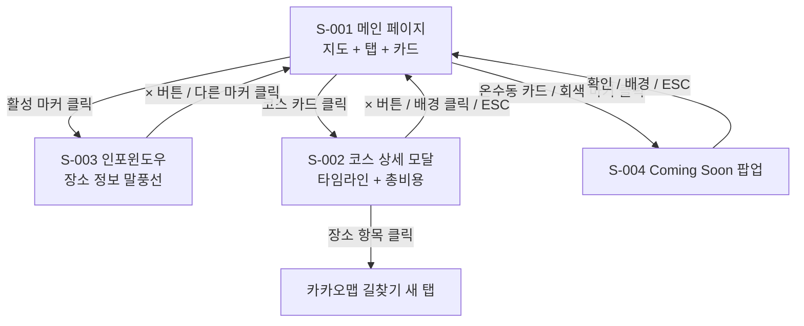
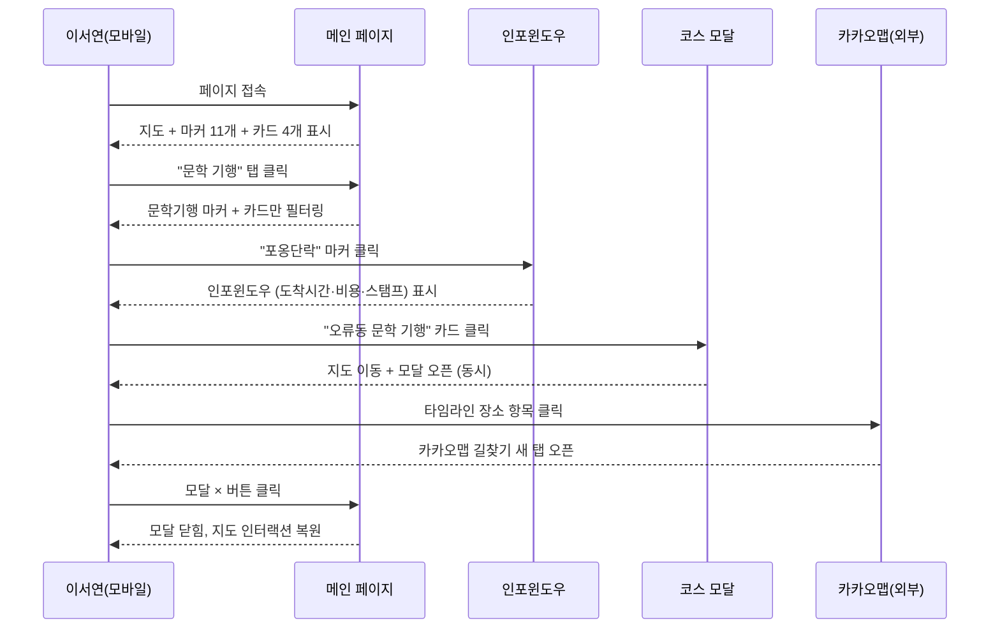
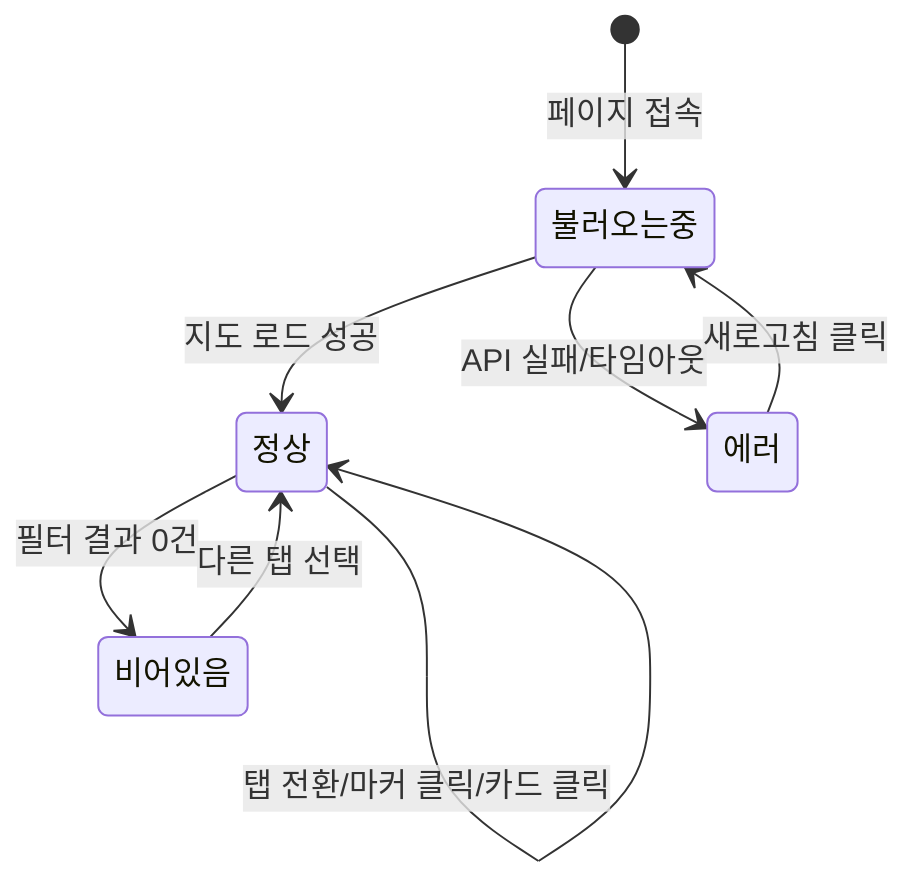
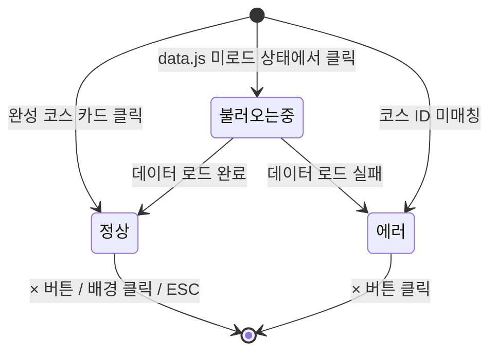
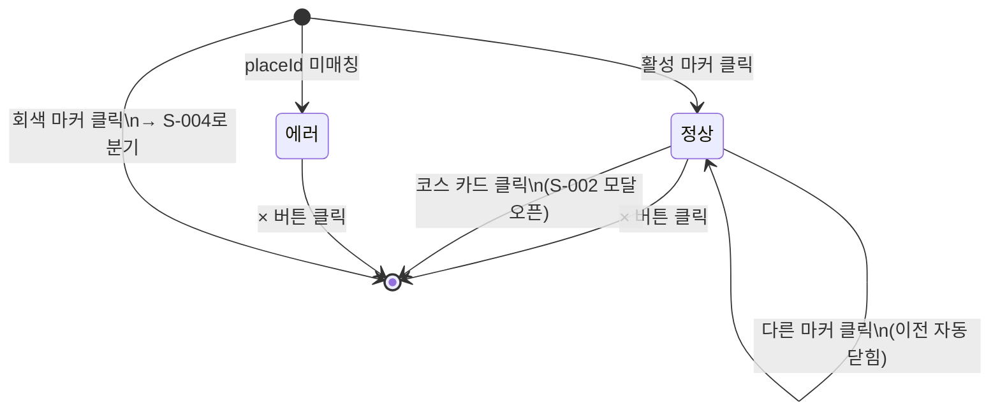
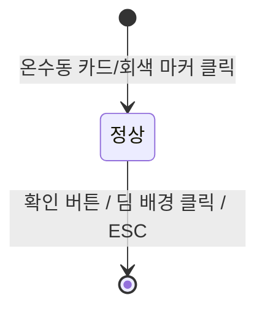
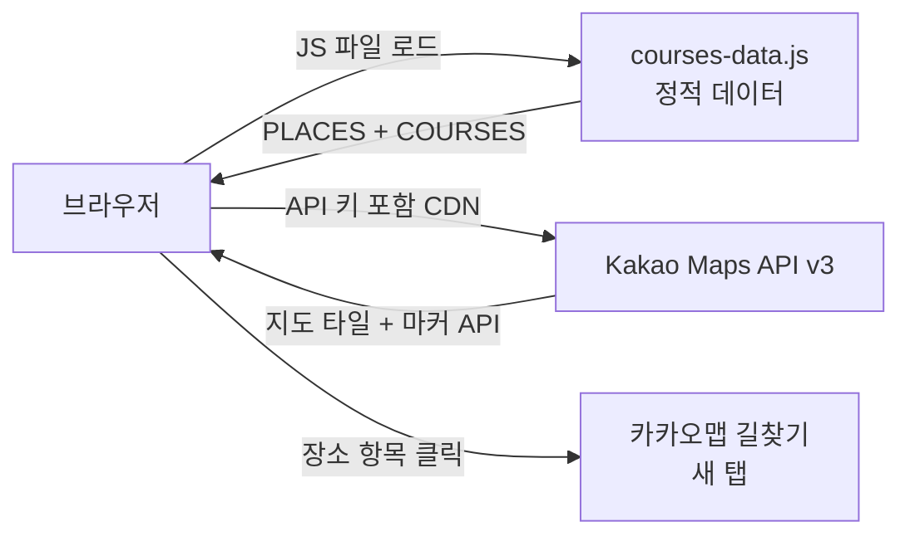

# 구로 여행코스 FRD

> 작성일: 2026-06-02 · 버전: v1.0
> PRD: `prd-구로여행코스-20260602.md` v1.0
> 디자인 시스템: `design-system-구로여행코스-20260602.md` v1.0
> 다음 단계: TRD (`frd-구로여행코스-20260602-handoff.md` 참조)

---

## 1. 한 문단 요약

구로 여행코스 FRD는 총 4개 화면(메인 페이지·코스 상세 모달·인포윈도우·Coming Soon 팝업)을 다루며, 그 중 핵심은 메인 페이지(S-001)와 코스 상세 모달(S-002)이다. 이 두 화면이 없으면 이서연(27세 핵심 페르소나)이 코스를 탐색하고 출발을 결정하는 흐름 자체가 성립하지 않는다. v1 출시 범위는 4개 화면 전부이며, 온수동 코스 콘텐츠만 Coming Soon으로 처리한 채 제출한다.

1인 개발자가 2일 안에 완성해야 하므로 기술 복잡도는 최소화했다. 서버·DB 없이 정적 HTML+Tailwind CDN+Vanilla JS+Kakao Maps API만으로 구현하고, 모든 코스 데이터는 courses-data.js 단일 파일에 담는다. TRD에서 결정할 큰 항목은 Kakao Maps API 좌표 확정(11개 장소 실측값)과 이미지 파일 경로 구조이며, 미해결 항목은 2건이다.

---

## 2. 무엇을 만드는가 (화면 지도)

이 서비스는 URL이 하나인 단일 페이지다. 사용자는 메인 페이지(S-001)에서 출발해 지도 마커를 클릭하면 인포윈도우(S-003)가 뜨고, 코스 카드를 클릭하면 코스 상세 모달(S-002)이 열린다. 온수동 카드 또는 회색 마커를 클릭하면 Coming Soon 팝업(S-004)이 나타난다. 모든 팝업과 모달은 S-001 위에 레이어로 덮이며, 닫으면 S-001로 돌아온다.

### 2.1 전체 화면 흐름



### 2.2 화면 분류 (Tier)

v1에서 다루는 화면은 총 4개다. Core 2개는 없으면 서비스가 성립하지 않는 화면이고, Tier 1과 Tier 2는 Core를 보조하거나 미완성 콘텐츠를 처리한다. 4개 모두 v1 범위에 포함된다.

| Tier | 의미 | 화면 | v1 포함 |
|---|---|---|---|
| Core | 없으면 서비스 불가 | S-001 메인 페이지, S-002 코스 상세 모달 | ✅ |
| Tier 1 | 필수 보조 컴포넌트 | S-003 인포윈도우 | ✅ |
| Tier 2 | 미완성 콘텐츠 처리 | S-004 Coming Soon 팝업 | ✅ |

> 정밀한 화면 ID 카탈로그(S-001~S-004)와 URL은 핸드오프 파일 §1 참조.

---

## 3. MVP 범위 (핵심 1~2개)

FRD��서 가장 중요한 결정은 무엇이 "없으면 안 되는 것"인가를 확정하는 것이다. 이 서비스에서 그 기준은 하나다 — "이 기능이 없으면 이서연이 코스를 찾아 떠날 수 없는가?"

### 3.1 핵심 화면 (Core)

#### Core-1: S-001 메인 페이지

S-001은 이 서비스의 전부다. 접속하는 순간부터 닫기 전까지 이서연이 머무는 유일한 공간이다. 탭을 눌러 테마를 고르고, 지도 마커로 장소를 확인하고, 카드로 코스 전체를 조망하는 모든 흐름이 이 화면 하나에서 이루어진다. 지도와 카드는 탭 전환 시 항상 동시에 반응해야 한다. 한쪽만 바뀌면 사용자는 혼란을 느끼고 페이지를 이탈한다.

화면은 고정 헤더(2행: 1행 로고, 2행 탭) → 카카오 지도(마커 11개) → 코스 카드 그리드 순으로 쌓인다. 탭이 헤더에 고정되어 있어, 카드를 스크롤하는 중에도 테마를 바꿀 수 있다. 모바일 1열 → 태블릿 2열 → 데스크탑 4열로 반응형 확장된다.

#### Core-2: S-002 코스 상세 모달

S-002는 이서연이 "오늘 얼마 들지, 몇 시에 어디서 뭘 하는지"를 한 번에 파악하고 출발을 결정하는 화면이다. 코스 카드를 클릭하면 지도가 해당 코스 첫 번째 마커로 동시에 이동하면서 모달이 열린다. 11개 장소가 세로 타임라인으로 이어지고, 고정 푸터에 1인 예상 총비용이 항상 표시된다.

모바일에서는 아래에서 올라오는 바텀시트 형태(화면 높이 85%)로, PC에서는 화면 중앙 모달로 표시된다. 닫기는 X 버튼·배경 클릭·ESC 세 가지 방법이 모두 작동한다. 타임라인의 각 장소 항목을 클릭하면 카카오맵 길찾기가 새 탭으로 열린다.

### 3.2 v1 출시 범위 (합산)

Core 2개와 Tier 1~2 화면 2개를 합쳐 총 4개 화면이 v1 출시 범위다. 1인 2일이라는 극도로 타이트한 일정을 고려해 모든 화면을 정적 데이터 기반으로 구현하고, 온수동 코스만 Coming Soon으로 처리한다.

| 항목 | 값 |
|---|---|
| Core 화면 | 2개 (S-001, S-002) |
| Tier 1 화면 | 1개 (S-003) |
| Tier 2 화면 | 1개 (S-004) |
| v1 출시 총 화면 | 4개 |
| 추정 개발 기간 (1인) | 2일 |

---

## 4. 사용자가 화면을 어떻게 거치는가 (시나리오)

이서연이 이 서비스를 만나는 대표 흐름 세 가지를 본다. 첫 번째는 모든 것이 순조롭게 흘러가는 경우, 두 번째는 네트워크가 느린 환경에서 접속한 경우, 세 번째는 온수동 코스를 클릭했다가 Coming Soon을 확인하는 경우다.

### 4.1 시나리오 1: 이서연의 주말 코스 탐색 (Happy Path)

토요일 아침, 이서연은 스마트폰으로 이 페이지에 접속한다. 헤더의 "문학 기행" 탭을 누르자 지도에서 자연·문화 마커는 사라지고 독립서점 초록 마커만 남는다. 아래 카드도 문학 기행 코스만 보인다. 그는 지도에서 "포옹단락" 마커를 클릭해 인포윈도우로 도착 시간과 예상 비용을 확인한다. 확신이 생기자 "오류동 문학 기행" 카드를 클릭한다. 지도가 오류동역 방향으로 이동하면서 코스 상세 모달이 동시에 열린다. 타임라인을 훑으며 총 55,000원을 확인한 그는 스크린샷을 찍어 친구에게 보낸다.



### 4.2 시나리오 2: 지하철 안, 네트워크가 느릴 때

이서연이 지하철 안에서 접속했다. 지도 영역에 회색 스켈레톤과 "지도를 불러오는 중..." 문구가 표시된다. 하지만 코스 카드는 지도와 독립적으로 먼저 로드되어 즉시 볼 수 있다. 그는 지도가 완성되기를 기다리는 동안 카드를 스크롤하며 코스를 파악한다. 지도가 로드되면 마커가 순차적으로 나타나고 정상 탐색을 이어간다.

### 4.3 시나리오 3: 온수동 코스를 클릭했을 때

이서연은 카드 그리드를 스크롤하다 온수동 코스 카드를 발견한다. 흐릿한 회색으로 처리되어 있고 "Coming Soon" 배지가 붙어 있다. 호기심에 클릭하자 S-004 Coming Soon 팝업이 열리며 "온수동 코스 준비 중 — 2025년 답사를 바탕으로 곧 업데이트됩니다."가 표시된다. 확인 버튼을 누르면 팝업이 닫힌다.

---

## 5. 화면별 명세

이 챕터에서 각 화면을 "이 화면은 무엇인가 → 어떻게 보이는가 → 어떻게 동작하는가" 순서로 본다. 요소 ID·검증 규칙 상세는 핸드오프 §3 참조.

### 5.1 S-001 메인 페이지

#### 이 화면은 무엇인가

S-001은 이 서비스의 전부이자 유일한 페이지다. 이서연이 처음 접속했을 때 마주치는 화면이고, 떠나기 전까지 머무는 공간이기도 하다. 테마 선택, 지도 동선 확인, 코스 카드 탐색, 코스 결정까지 모든 과정이 이 화면 하나에서 이루어진다.

화면은 고정 헤더(1행: 로고, 2행: 테마 탭) → 카카오 지도 → 코스 카드 그리드 순으로 쌓인다. 탭이 헤더 2행에 고정되어 있어 어느 위치에서 스크롤해도 테마를 바꿀 수 있다. 탭·지도·카드는 항상 동기화되어, 탭 전환 시 세 영역이 동시에 반응한다. 모달이 열린 상태에서 탭을 클릭하면 모달이 자동으로 닫힌 후 필터가 적용된다.

이 화면 설계 시 가장 주의할 점은 두 가지다. 첫째, 지도와 카드는 항상 같은 테마를 표시해야 한다. 둘째, 모달이 열린 동안 지도는 터치 이벤트를 받아서는 안 된다(pointer-events: none).

#### 어떻게 보이는가 (구성)

모바일에서 헤더 약 70px(로고 행 + 탭 행), 지도 화면 너비의 56%(최소 220px, 최대 360px), 그 아래 코스 카드 그리드가 이어진다. 태블릿(640px 이상)에서 카드 2열, 데스크탑(1024px 이상)에서 4열로 확장된다.

| 사용자가 보는 것 | 위치 | 비고 |
|---|---|---|
| 서비스 로고·이름 | 헤더 1행 | 스크롤 고정 |
| 테마 탭 (전체·문학기행·힐링) | 헤더 2행 | 스크롤 고정, 가로 스크롤 대응 |
| 카카오 지도 (마커 11개) | 헤더 아래 전체 너비 | 색상 구분 마커 (서점🟢·시장카페🟡·자연🔵·Coming Soon⚪) |
| 코스 카드 그리드 | 지도 아래 | 탭 연동 필터링 |
| 정보 기준일 안내 문구 | 페이지 최하단 | "2025.05.27 답사 기준, 방문 전 확인 권장" |

> 정밀한 요소 ID(E-001~), 타입, 라벨, 클릭 동작은 핸드오프 §3 참조.

#### 어떻게 동작하는가 (5개 상태)

이 화면은 카카오 지도 로드 여부와 데이터 상태에 따라 다섯 가지 모습으로 변한다. 지도와 카드는 독립적으로 로드되므로, 지도가 느려도 카드는 즉시 보인다.

**정상 (Success)**
지도와 마커 11개, 코스 카드 4개(완성)와 Coming Soon 카드 2개가 모두 표시된다. 탭·마커·카드 모두 인터랙션이 가능하다. 기본 탭은 "전체"로 활성화되어 있다.

**불러오는 중 (Loading)**
카카오 API 응답을 기다리는 동안 지도 영역에 회색 스켈레톤과 "지도를 불러오는 중..." 문구가 표시된다. 코스 카드는 courses-data.js를 즉시 읽어 지도와 독립적으로 렌더링되어 이미 보이는 상태다.

**문제가 생겼을 때 (Error)**
카카오 API 호출 실패 또는 타임아웃 시 지도 영역에 "지도를 불러올 수 없습니다. 네트워크를 확인하고 새로고침 해주세요"와 새로고침 버튼이 표시된다. 코스 카드는 정상 표시를 유지한다. courses-data.js 404 오류 시에는 카드 영역에도 에러 안내가 표시된다.

**비어있을 때 (Empty)**
탭 필터 결과가 0건일 때 카드 영역에 "아직 준비 중인 코스입니다" 안내가 표시된다. 현재 데이터 구조상 발생 빈도가 낮지만, Coming Soon 카드만 남는 경우를 대비해 정의해둔다.

**잠겼을 때 (Disabled)**
온수동 코스 카드 2개는 회색 흐림 처리와 "Coming Soon" 배지로 표시된다. 온수동 마커도 회색 비활성 상태다. 페이지 전체가 Disabled 상태가 되는 경우는 없다.



#### 인터랙션 핵심

이서연이 이 화면에서 할 수 있는 주요 행동은 탭 선택, 마커 클릭, 카드 클릭 세 가지다. 탭을 누르면 지도 마커와 카드가 동시에 필터링되고(디바운스 100ms), 마커를 클릭하면 인포윈도우가 열리며, 카드를 클릭하면 지도 이동과 모달 오픈이 동시에 발생한다.

| 사용자 행동 | 시스템 반응 |
|---|---|
| 테마 탭 클릭 | 해당 테마 마커 표시 + 카드 동시 필터링 (디바운스 100ms) |
| 활성 마커 클릭 | S-003 인포윈도우 오픈, 이전 인포윈도우 자동 닫힘 |
| 코스 카드 클릭 | 지도 해당 위치 이동 + S-002 모달 오픈 (동시) |
| Coming Soon 카드 / 회색 마커 클릭 | S-004 팝업 오픈 |
| 모달 열린 상태에서 탭 클릭 | 모달 자동 닫힘 → 탭 필터 적용 |
| 모달 열린 상태에서 지도 터치 | 차단 (pointer-events: none) |

---

### 5.2 S-002 코스 상세 모달

#### 이 화면은 무엇인가

S-002는 코스 카드를 클릭했을 때 S-001 위에 레이어로 열리는 상세 화면이다. 이서연은 여기서 코스의 모든 장소를 시간 순서로 확인하고, 예상 비용을 파악하고, 출발을 결정한다. 결정적으로, 모달을 열자마자 고정 푸터에 1인 총비용이 표시되어 "오늘 얼마 드는지"를 스크롤 없이 즉시 알 수 있다.

모바일에서는 화면 아래에서 올라오는 바텀시트 형태(최대 높이 85%)로, PC(640px 이상)에서는 화면 중앙 모달로 전환된다. 고정 헤더(코스명·소요시간·닫기 버튼)와 고정 푸터(1인 총비용)가 스크롤해도 항상 보인다. 타임라인의 각 장소 항목을 클릭하면 카카오맵 길찾기가 새 탭으로 열린다.

이 화면에서 가장 주의할 점은 모달이 열린 동안 배경의 지도가 터치에 반응하지 않도록 해야 한다는 것이다. 모달을 닫는 순간 pointer-events가 즉시 복원되어야 한다.

#### 어떻게 보이는가 (구성)

모달은 고정 헤더 → 스크롤 타임라인 → 고정 푸터 세 덩어리로 구성된다. 모바일에서는 모달 최상단에 드래그 힌트용 손잡이 바(시각 힌트만, 드래그 기능 없음)가 표시된다.

| 사용자가 보는 것 | 위치 | 비고 |
|---|---|---|
| 손잡이 바 | 모달 최상단 | 모바일만. 시각 힌트 전용 |
| 코스명 + 소요시간 요약 | 고정 헤더 왼쪽 | 스크롤해도 고정 |
| 닫기(×) 버튼 | 고정 헤더 오른쪽 | 터치 타깃 44×44px |
| 장소 타임라인 (11개) | 스크롤 영역 | 순서 번호·연결선·스탬프 배지 포함 |
| 카카오맵 길찾기 링크 | 각 장소 항목 | 클릭 시 새 탭 |
| 스탬프 배지 | 독립서점 4곳 항목 | "스탬프 ①~④" |
| 1인 예상 총비용 | 고정 푸터 | 스크롤해도 고정 |

#### 어떻게 동작하는가 (5개 상태)

S-002는 정적 데이터(courses-data.js)를 즉시 읽어 렌더링하므로 실질적인 Loading 대기는 거의 없다. 그럼에도 데이터 오류 상황을 대비해 5개 상태를 정의한다.

**정상 (Success)**
카드 클릭 즉시 타임라인 11개 장소가 표시된다. 스탬프가 있는 독립서점 4곳에는 초록 배지가 붙는다. 고정 헤더에 코스명, 고정 푸터에 1인 총비용이 표시된다.

**불러오는 중 (Loading)**
courses-data.js 파일이 아직 로드되지 않은 극히 짧은 순간, 타임라인 영역에 스켈레톤 3줄이 표시된다. 저사양 기기나 느린 네트워크 환경을 대비한 대응이다.

**문제가 생겼을 때 (Error)**
courses-data.js에서 해당 코스 ID를 찾지 못할 경우, 타임라인 영역에 "코스 정보를 불러올 수 없습니다"가 표시되고 닫기 버튼만 활성화된다.

**비어있을 때 (Empty)**
stops 배열이 비어 있는 코스 데이터가 전달될 경우 "장소 정보 준비 중입니다" 안내가 표시된다. 현재 완성된 코스 데이터에서는 발생하지 않는다.

**잠겼을 때 (Disabled)**
Coming Soon 코스는 이 모달이 열리지 않고 S-004로 분기된다.



#### 인터랙션 핵심

이서연이 이 화면에서 할 수 있는 행동은 타임라인 스크롤, 장소 항목 클릭(길찾기), 모달 닫기 세 가지다.

| 사용자 행동 | 시스템 반응 |
|---|---|
| 타임라인 위아래 스크롤 | 헤더·푸터 고정, 타임라인만 스크롤 |
| 장소 항목 클릭 | 카카오맵 길찾기 새 탭 오픈 |
| × 버튼 / 딤 배경 클릭 / ESC | 모달 닫힘, 지도 pointer-events 복원 |
| S-001 탭 클릭 (모달 열린 상태) | 모달 자동 닫힘 → 탭 필터 적용 |
| 키보드 Tab | 모달 내부 요소만 순환 (포커스 트랩) |

---

### 5.3 S-003 인포윈도우 팝업

#### 이 화면은 무엇인가

S-003은 지도 위 마커를 클릭하면 해당 마커 위에 떠오르는 말풍선 정보창이다. 장소의 도착 시간·활동·예상 비용·스탬프 여부를 즉시 보여주는 중간 탐색 단계 역할을 한다. 이서연이 "여기서 뭘 하고 얼마가 드는지"를 3초 안에 파악하고 카드 클릭 여부를 결정하는 데 쓰인다.

한 번에 하나의 인포윈도우만 열린다. 마커 A가 열린 상태에서 마커 B를 클릭하면 A가 자동으로 닫히고 B가 열린다. 코스 카드를 클릭하면 인포윈도우가 자동으로 닫힌 후 S-002 모달이 열린다.

#### 어떻게 보이는가 (구성)

클릭된 마커 바로 위에 떠오르는 흰색 말풍선 카드(너비 200~240px)다. 화면 가장자리에서는 카카오 API의 자동 패닝(disableAutoPan: false)으로 위치가 보정된다.

| 사용자가 보는 것 | 비고 |
|---|---|
| 장소명 | 굵게 표시 |
| 도착 시간 + 체류 시간 | "10:40 도착 · 30분" |
| 활동 한 줄 설명 | 장소별 고유 내용 |
| 예상 비용 | 브랜드 그린으로 강조 |
| 스탬프 배지 | 독립서점 4곳만 ("스탬프 ①") |
| 닫기(×) 버튼 | 오른쪽 상단 |

#### 어떻게 동작하는가 (5개 상태)



**정상**: 클릭 즉시 장소 전체 정보 표시. 이전 인포윈도우 자동 닫힘.
**에러**: placeId 미매칭 시 장소명만 표시, 나머지 "정보 준비 중".
**비활성**: 회색(온수동) 마커는 인포윈도우 없이 S-004로 분기. 인포윈도우 이벤트 미연결.

#### 인터랙션 핵심

| 사용자 행동 | 시스템 반응 |
|---|---|
| 활성 마커 클릭 | 인포윈도우 오픈, 이전 인포윈도우 자동 닫힘 |
| 다른 마커 클릭 | 현재 닫힘 → 새것 오픈 |
| × 버튼 클릭 | 인포윈도우 닫힘 |
| 코스 카드 클릭 | 인포윈도우 닫힘 → S-002 모달 오픈 |
| 회색 마커 클릭 | S-004 팝업으로 분기 (인포윈도우 미오픈) |
| 지도 빈 영역 클릭 | 인포윈도우 유지 |

---

### 5.4 S-004 Coming Soon 팝업

#### 이 화면은 무엇인가

S-004는 온수동 코스 카드 또는 온수동 회색 마커를 클릭했을 때 열리는 소형 안내 팝업이다. 미완성 콘텐츠를 빈 화면이나 오류처럼 보이지 않게 처리하면서, 포트폴리오 서비스가 완결되어 보이게 만드는 역할을 한다. 화면 중앙에 딤 배경과 함께 표시된다.

#### 어떻게 보이는가 (구성)

| 사용자가 보는 것 | 비고 |
|---|---|
| 아이콘 (책 이모지) | 시각적 앵커 |
| 제목: "온수동 코스 준비 중" | 굵게 표시 |
| 안내 문구 | "2025년 답사를 바탕으로 곧 업데이트됩니다." |
| 확인 버튼 | 클릭 시 팝업 닫힘 |

#### 어떻게 동작하는가 (5개 상태)



정적 콘텐츠라 Loading·Error 상태 없음. 정상과 닫힘 두 가지 상태만 존재한다.

#### 인터랙션 핵심

| 사용자 행동 | 시스템 반응 |
|---|---|
| 온수동 카드 / 회색 마커 클릭 | 팝업 오픈, 딤 배경 처리 |
| 확인 버튼 / 딤 배경 클릭 / ESC | 팝업 닫힘 |

---

## 6. 공통 컴포넌트와 권한

여러 화면에서 반복 등장하는 공통 요소와 이 서비스의 권한 구조를 정리한다.

### 6.1 공통 컴포넌트

이 서비스의 공통 컴포넌트는 딤 배경 레이어 하나다. S-002 모달과 S-004 팝업이 열릴 때 동일한 반투명 검정 배경(rgba 0,0,0 / 0.45)이 S-001 위에 깔린다. 딤 배경을 클릭하면 해당 레이어가 닫힌다. S-003 인포윈도우는 카카오 지도 API 내부 레이어로 동작하므로 딤 배경을 사용하지 않는다.

| 공통 요소 | 사용 화면 | 동작 |
|---|---|---|
| 딤 배경 레이어 | S-002, S-004 | 클릭 시 해당 레이어 닫힘 |
| ESC 키 닫기 | S-002, S-004 | 포커스 무관하게 최상위 레이어 닫힘 |
| 포커스 트랩 | S-002, S-004 | 모달/팝업 내부 요소만 Tab 순환 |

### 6.2 권한 차이 요약

이 서비스는 로그인·회원가입이 없는 전체 공개 정적 웹페이지다. 모든 화면과 기능이 비로그인 상태에서 동일하게 접근 가능하다. 브라우저 GPS 권한은 v1에서 요청하지 않는다.

| 화면·기능 | 비로그인 (유일한 상태) |
|---|---|
| S-001~S-004 전체 | ✅ 전체 공개 |
| GPS 위치 | 미사용 (v2 예정) |

---

## 7. 외부에 무엇이 필요한가 (의존성)

이 서비스의 외부 의존성은 카카오 Maps API 하나다. 이 API가 없으면 지도 렌더링·마커 표시·인포윈도우·지도 이동이 모두 불가능하다. 단, 코스 카드 그리드는 API와 독립적으로 동작하도록 설계되어, API 실패 시에도 코스 정보 조회는 가능하다.

| 의존 대상 | 용도 | 누락 시 영향 |
|---|---|---|
| Kakao Maps API v3 | 지도 렌더링·마커·인포윈도우·지도 이동 | 지도 기능 전체 불가. 카드 그리드는 정상 |
| Google Fonts (Noto Serif KR, Pretendard) | 폰트 로드 | 시스템 폰트로 폴백. 레이아웃 유지 |
| courses-data.js | 코스·장소 정적 데이터 | 전체 기능 불가 |



> API 키 형식·도메인 제한 설정·마커 생성 함수 상세는 핸드오프 §7 참조. TRD에서 더 깊게 다룬다.

---

## 8. 비개발자가 빠뜨리기 쉬운 것 점검 (Blindspot Check)

FRD 작성 완료 후 5종 사각지대를 전수 점검한 결과다. HIGH 이슈 0건으로 TRD 진행 가능 판정을 받았다.

| 점검 항목 | 결과 |
|---|---|
| 5개 상태 (Empty/Loading/Error/Success/Disabled) | ✅ 4개 화면 모두 정의 |
| 예외 흐름 (API 실패·파일 404·JS 비활성화 등) | ✅ 5건 발견·처리 방안 확정 |
| 권한 매트릭스 | ✅ 전체 공개, 분기 없음 |
| 검증 규칙 (데이터 범위·배열 존재 여부) | ✅ 4건 기준 확정 |
| 엣지 케이스 (빠른 탭 전환·모달+탭 충돌 등) | ✅ 7건 발견·처리 방안 확정 |

상세 발견 사항과 처리 방안은 부록 A 참조.

---

## 9. 미해결 / 향후 단계

FRD 단계에서 결정을 미룬 항목 2건과 v2 이후 항목이다.

- **11개 장소 실측 좌표**: 현재 추정값으로 작성됨. 카카오 주소 검색 API 또는 직접 클릭으로 실측 확정 필요. TRD 시작 전 처리 필수.
- **카드 대표 이미지 파일**: 이미지 6장(오류동·항동 × 문학기행·힐링 코스) 준비 및 경로 확정 필요. TRD에서 파일 구조 확정.
- **v2 이후**: 동선 경로선(Polyline), 현재 위치 표시, AI 맞춤 코스 생성, 온수동 코스 콘텐츠 추가.

---

## 부록 A. 적대적 검토 결과

```
━━━ 🔍 적대적 검토 ━━━
검토 관점: Dev + QA (TRD 작성자 관점)
검토 대상: 구로 여행코스 FRD v1.0

🔴 HIGH: 0건

🟡 MEDIUM: 2건
  1. 모달 열린 상태에서 탭 전환 시 처리
     → 모달 자동 닫힘 후 필터 적용으로 확정 (§5.1 인터랙션 반영)
  2. 페이지 로드 직후 빠른 카드 클릭 (지도 초기화 전)
     → kakao.maps 객체 null 체크 후 이동 스킵, 모달만 오픈으로 확정

🟢 LOW: 21건
  - 마커 일부 생성 실패 → 기본 마커 폴백
  - 빠른 연속 탭 클릭 → 디바운스 100ms
  - 브라우저 뒤로가기 → 모달 닫힘 허용
  - 화면 회전 → 모달 max-height 재계산
  - 가장자리 마커 인포윈도우 → disableAutoPan: false
  - courses-data.js 404 → 카드 에러 안내
  - Kakao API 키 오류 → 지도 에러 상태
  - JS 비활성화 → noscript 안내
  - 이미지 404 → onerror 플레이스홀더 폴백
  - 카카오맵 앱 미설치 → 웹 버전 자동 이동
  - GPS 권한 → v1 미사용
  - 팝업 차단 → a 태그 방식으로 우회
  - 좌표 범위 이탈 → 콘솔 경고만
  - stops 0개 → Empty 상태 표시
  - 구형 기기 느린 로딩 → 스켈레톤 유지
  - 320px 이하 → 가로 스크롤 허용
  - 긴 장소명 → ellipsis 처리
  - 탭+지도 API 지연 겹침 → 충돌 없음 (재호출 불필요)
  - 두 손가락 핀치줌 마커 겹침 → 카카오 기본 동작
  - placeId 미매칭 → 장소명만 표시
  - 회색 마커 인포윈도우 이벤트 → 미연결, S-004 분기

━━━ 요약 ━━━
🔴 HIGH: 0건 / 🟡 MEDIUM: 2건 (처리 방안 확정) / 🟢 LOW: 21건 (처리 방안 명시)
진행 판정: 전 항목 처리 방안 확정됨 → TRD 진행 가능.
━━━━━━━━━━━━━━━━━━━━━━
```
